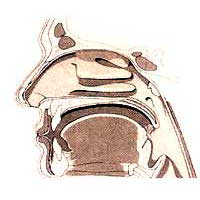

La <b>sympathicothérapie</b> est une technique utilisant les zones réflexes endonasales dans un but thérapeutique. Elle s’apparente aux autres méthodes réflexogènes telles que l’acupuncture, l’auriculothérapie et la podoréflexologie.

Cette méthode s’intègre parfaitement dans les thérapeutiques naturelles et permet des résultats rapides, sans aucun danger et sans réactions douloureuses.

La <b>sympathicothérapie</b> corrige les déséquilibres neurovégétatifs générateurs de maladies dites fonctionnelles, qui représentent la majorité des motifs de consultation.

La <b>sympathicothérapie</b> réalise le traitement d’élection de toutes pathologies liées au <b>stress</b>, et particulièrement :

<table style="width:100%;">
<tbody>
<tr>
<td>
<ul>
<li>L’insomnie</li>
<li>Les dépressions nerveuses</li>
<li>Les troubles digestifs</li>
<li>Les troubles génitaux</li>
<li>Les sinusites</li>
<li>L’asthme</li>
<li>L’hypertension</li>
<li>Les névralgies</li>
<li>Les troubles de la ménopause</li>
</ul>
</td>
<td>
<ul>
<li>Les migraines et céphalées</li>
<li>L’angoisse</li>
<li>La constipation</li>
<li>La spasmophilie</li>
<li>Les troubles de la sphère ORL</li>
<li>L’obésité</li>
<li>L’hypotension</li>
<li>L’énurésie</li>
<li>Etc.</li>
</ul>
</td>
</tr>
</tbody>
</table>

Le nombre de séances peut varier de 1 à 12 suivant les cas cliniques. Les fréquences de traitement sont de 1 à 2 par semaine.

